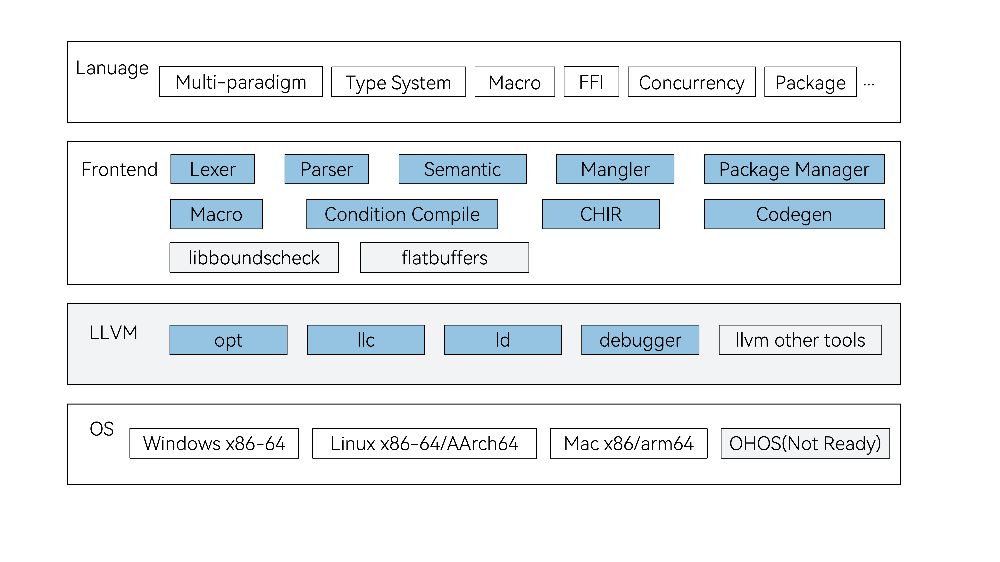

# Cangjie Programming Language Compiler

## Introduction

Cangjie is a general-purpose programming language designed for all-scenario application development. It balances development efficiency and runtime performance, providing an excellent programming experience. Cangjie features concise and efficient syntax, multi-paradigm programming, and type safety. For more information, please refer to the [Cangjie Language Developer Guide](https://cangjie-lang.cn/docs?url=%2F1.0.0%2Fuser_manual%2Fsource_zh_cn%2Ffirst_understanding%2Fbasic.html) and the [Cangjie Programming Language White Paper](https://cangjie-lang.cn/docs?url=%2F0.53.18%2Fwhite_paper%2Fsource_zh_cn%2Fcj-wp-abstract.html).

This repository provides the source code of the Cangjie compiler, comprises two parts: the compiler frontend and the modified open-source LLVM components. The latter includes the LLVM compiler backend, the opt optimizer, llc, the ld linker, and debuggers etc. For dependencies related to open-source LLVM components, please refer to the [Third-Party Library Patch Documentation](./third_party/README.md). The overall architecture is shown in the following diagram:



**Architecture Diagram Description**

- **Compiler Frontend**: Responsible for converting Cangjie source code from text to intermediate representation, covering lexical, syntax, macro, and semantic analysis to ensure the correctness of code structure and semantics, and preparing for backend code generation. This module relies on mingw-w64 to support Windows platform's Cangjie capability, enabling it to generate final executable binaries for users that can call Windows APIs. It also depends on libboundscheck to provide secure function library access.

    - **Lex/Parse**: Breaks down Cangjie source code into meaningful tokens, constructs an abstract syntax tree (AST) from the token sequence according to Cangjie grammar rules, reflecting the program structure.

    - **Sema/Type Infer**: Performs type checking, scope analysis, etc. on the AST to ensure the correctness of program semantics.

    - **Mangle**: Responsible for performing name mangling on Cangjie symbols, and also includes a demangler tool for reverse parsing.

    - **Package Manage**: Manages and loads code modules, handles dependencies and namespace isolation, and supports collaborative development across multiple modules.

    - **Macro Expand**: Processes macro definitions and macro calls in the code to achieve code generation and reuse.

    - **Condition/Incr Compile**: Condition compilation allows for building code based on predefined or user-defined conditions, while incremental compilation can accelerate the current build speed by leveraging cached files from previous compilations.

    - **CHIR**: Converts the AST into the compiler's intermediate representation for optimization and backend processing.

    - **LLVM IR Codegen**: Translates the intermediate representation (CHIR) into LLVM IR, preparing to generate target machine code (LLVM BitCode).

- **LLVM**: receives the intermediate representation generated by the frontend, performs optimization, generates target platform machine code, and integrates it into executable files through the linker.

    - **Opt**: Performs various optimizations on LLVM IR, such as constant folding and loop optimization, to improve the execution efficiency and quality of the generated code.

    - **llc**: Converts the optimized LLVM IR into target platform machine code, adapting to different hardware architectures.

    - **ld**: Links multiple object files and dependent libraries into the final executable, resolves symbol references, and generates deployable program.

    - **debugger**: Provides debugging capabilities related to the Cangjie language.

For other toolchains of LLVM and more detailed descriptions of backend tools, please refer to the [LLVM Command Guide](https://llvm.org/docs/CommandGuide/).

- **OS**: The Cangjie Compiler and related toolchains currently support running on the following platforms: Windows x86-64, Linux x86-64/AArch64, and macOS x86_64/arm64. Support for the OpenHarmonyOS platform is under development. In addition to natively compiling outputs for the aforementioned platforms, the Cangjie Compiler also supports cross-compiling to generate binary outputs for the ohos-aarch64 platform. For details, please refer to the [Cangjie SDK Integration and Build Guide](https://gitcode.com/Cangjie/cangjie_build).

## Directory Structure

```text
cangjie_compiler/
├── cmake                       # CMake folder for build helper scripts
├── demangler                   # Symbol demangling
├── doc                         # documentations
├── figures                     # figures for documentations
├── include                     # Header files
├── integration_build           # Cangjie SDK Integration Build Script
├── schema                      # FlatBuffers Schema serialization data structure files
├── src                         # Compiler source code
│   ├── AST                     # Abstract Syntax Tree components
│   ├── Basic                   # Basic compiler components
│   ├── CHIR                    # Compiler intermediate representation, optimization and analysis
│   ├── CodeGen                 # Code generation, translates CHIR to LLVMIR
│   ├── ConditionalCompilation  # Conditional compilation
│   ├── Driver                  # Compiler driver, launches frontend and invokes backend commands
│   ├── Frontend                # Compiler instance class, organizes compilation process
│   ├── FrontendTool            # Compiler instance class for external tools
│   ├── IncrementalCompilation  # Incremental compilation
│   ├── Lex                     # Lexical analysis
│   ├── Macro                   # Macro expansion
│   ├── main.cpp                # Compiler entry point
│   ├── Mangle                  # Symbol mangling
│   ├── MetaTransformation      # Metaprogramming compiler plugins
│   ├── Modules                 # Package management module
│   ├── Option                  # Compiler options control
│   ├── Parse                   # Syntax analysis
│   ├── Sema                    # Semantic analysis
│   └── Utils                   # Common utilities
├── third_party                 # Third-party build scripts and patch files
│   ├── cmake                   # Third-party CMake helper scripts
│   ├── llvmPatch.diff          # LLVM backend patch file, includes LLVM and cjdb source
│   └── flatbufferPatch.diff    # FlatBuffers source patch file
├── unittests                   # Unit Test Cases
└── utils                       # Compiler-related utilities
```

## Constraints

Building the Cangjie compiler is supported on Ubuntu/MacOS (x86_64, aarch64) environments. For more details on environment and tool dependencies, please refer to the [Build Dependency Tools](https://gitcode.com/Cangjie/cangjie_build/blob/dev/docs/env_zh.md).

## Building from Source

> **Note:**
>
> This section describes how to build the Cangjie compiler from source. If you want to use the Cangjie compiler to compile Cangjie source code or projects, please skip this section and go to the [Cangjie Official Download Page](https://cangjie-lang.cn/download) to get the release package, or refer to the [Integration Build Guide](#integration-build-guide) for integrated builds.

### Preparation

For environment requirements and software dependencies on each platform, please refer to the [Standalone Build Guide](doc/Standalone_Build_Guide.md).

Download the source code:

```shell
git clone https://gitcode.com/Cangjie/cangjie_compiler.git -b main;
```

### Build Steps

```shell
cd cangjie_compiler
python3 build.py clean
python3 build.py build -t release
python3 build.py install
```

1. The `clean` command clears temporary files in the workspace.
2. The `build` command starts compilation. The `-t` or `--build-type` option specifies the build type, which can be `release`, `debug` or `relwithdebinfo`.
3. The `install` command installs the build artifacts to the `output` directory.

The `output` directory structure is as follows:

```text
./output
├── bin
│   ├── cjc                 # Cangjie compiler executable
│   └── cjc-frontend -> cjc # Cangjie compiler frontend executable
├── envsetup.sh             # One-click environment variable setup script
├── include                 # Public header files for the frontend
├── lib                     # Libraries required by the Cangjie build, subfolders by target platform
├── modules                 # Reserved folder for Cangjie standard library cjo files, subfolders by target platform
├── runtime                 # Runtime libraries required by the Cangjie build
├── third_party             # Third-party binaries and libraries such as LLVM
└── tools                   # Cangjie tools folder
```

On Linux, you can apply the cjc environment with `source ./output/envsetup.sh`, and check the current compiler version and platform info with `cjc -v`:

```shell
source ./output/envsetup.sh
cjc -v
```

Output as follows:

```text
Cangjie Compiler: x.xx.xx (cjnative)
Target: xxxx-xxxx-xxxx
```

### Running unittest test cases

Unit test cases are built by default during the build process. After a successful build, you can verify them with the following command:

```shell
python3 build.py test
```

### More Build Options

For more build options, please refer to the [build.py build script](./build.py) or use the `--help` option:

```shell
python3 build.py --help
```

For more platform-specific build information, see the [Standalone Build Guide](doc/Standalone_Build_Guide.md).

### Integration Build Guide

For integration builds, please refer to the [Cangjie SDK Integration Build Guide](https://gitcode.com/Cangjie/cangjie_build/blob/dev/README_zh.md).

## Related Repositories

- [cangjie_docs](https://gitcode.com/Cangjie/cangjie_docs/tree/main/docs/dev-guide)
- [cangjie_runtime](https://gitcode.com/openharmony-sig/third_party_cangjie_runtime)
- [cangjie_tools](https://gitcode.com/openharmony-sig/third_party_cangjie_tools)
- [cangjie_stdx](https://gitcode.com/openharmony-sig/third_party_cangjie_stdx)
- [cangjie_build](https://gitcode.com/Cangjie/cangjie_build)
- [cangjie_test](https://gitcode.com/Cangjie/cangjie_test)

## Open Source Software Statement

| Software Name       | License                              | Usage Description                                                                                                                                                                | Main Component                | Usage Method                                                         |
|---------------------|--------------------------------------|----------------------------------------------------------------------------------------------------------------------------------------------------------------------------------|-------------------------------|----------------------------------------------------------------------|
| mingw-w64           | Zope Public License V2.1             | The Cangjie Windows SDK includes some static libraries from Mingw, which are linked with Cangjie-generated object files to produce final executables that can call Windows APIs. | Compiler                      | Integrated into the Cangjie binary release                           |
| LLVM                | Apache 2.0 with LLVM Exception       | The Cangjie compiler backend is developed based on LLVM.                                                                                                                         | Compiler                      | Integrated into the Cangjie binary release                           |
| flatbuffers         | Apache License V2.0                  | Cangjie's cjo files and macro implementations rely on this software for serialization and deserialization.                                                                       | Compiler & StdLib (std.ast)   | Integrated into the Cangjie binary release                           |
| libboundscheck      | Mulan Permissive Software License V2 | Related code in the compiler, standard library, and extension library is implemented based on this software.                                                                     | Compiler, StdLib, Extension   | Integrated into the Cangjie binary release                           |

For information on the usage of mingw-w64 and other build dependencies, please refer to [Build Dependency Tools](https://gitcode.com/Cangjie/cangjie_build/blob/dev/docs/env_zh.md) and [Cangjie SDK Integration and Build Guide](https://gitcode.com/Cangjie/cangjie_build/blob/dev/README_zh.md).
## Contribution

We welcome contributions from developers in any form, including but not limited to code, documentation, issues, and more.