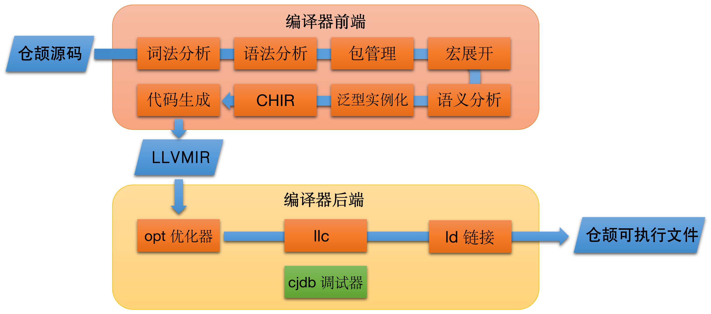

# 仓颉编程语言编译器

## 简介

仓颉编程语言是一种面向全场景应用开发的通用编程语言，可以兼顾开发效率和运行性能，并提供良好的编程体验。仓颉语言具有语法简明高效、多范式编程、类型安全等特点，了解更多仓颉语言的介绍，请参阅 [仓颉语言开发指南](https://cangjie-lang.cn/docs?url=%2F1.0.0%2Fuser_manual%2Fsource_zh_cn%2Ffirst_understanding%2Fbasic.html) 以及 [仓颉编程语言白皮书](https://cangjie-lang.cn/docs?url=%2F0.53.18%2Fwhite_paper%2Fsource_zh_cn%2Fcj-wp-abstract.html)。

本仓提供了仓颉编译器相关源码，整体包含两部分：编译器前端和 LLVM 开源修改部分，后者包括 LLVM 编译器后端 opt 优化器、llc、ld 链接器以及调试器等。LLVM 开源组件依赖部分可参考[第三方库 patch 说明](./third_party/README.md)。 整体架构如下图展示：



**架构图说明**

- **前端**：负责将仓颉源码从文本转换为中间表示，涵盖词法、语法、宏、语义等分析，确保代码结构和语义正确，为后端生成目标代码做好准备。此模块依赖 mingw-w64 用以支持 Windows 平台仓颉能力，为用户生成最终的可以调用 Windows API 的可执行二进制文件。同时依赖 libboundscheck 提供安全函数库访问。

    - **词法分析**将仓颉源码分解为有意义的记号。

    - **语法分析**根据仓颉语法规则，将记号序列构建为抽象语法树（AST），反映程序结构。

    - **语义分析**对 AST 进行类型检查、类型推断、作用域分析等，确保程序语义正确。

    - **名称修饰**负责对仓颉符号进行名称修饰，同时还包含 demangler 反向解析工具。

    - **包管理**负责管理和加载代码模块，处理依赖关系与命名空间隔离，支持多模块协同开发，此模块依赖 flatbuffer 三方库能力进行序列化和反序列化。

    - **元编程**宏展开处理，处理代码中的宏定义和宏调用，实现代码生成和复用。

    - **条件编译**条件编译可以通过预定义或者自定的条件进行编译。

    - **CHIR 生成及优化**CHIR为 Cangjie High Level IR，此模块将 AST 转换为编译器中间层表示，并进行优化。

    - **LLVM IR 代码生成**将中间表示（CHIR）翻译为 LLVM IR，准备生成目标机器码（LLVM BitCode）。

- **LLVM**：包括编译器后端以及 LLVM 相关工具链，编译器后端接收前端生成的中间表示，经过优化、生成目标平台机器码，并通过链接器整合为可执行文件。

    - **opt 优化器**：对 LLVM IR 进行多种优化处理，如常量折叠、循环优化等，提高生成代码的执行效率和质量。

    - **llc 编译器**：将优化后的 LLVM IR 转换为目标平台的机器码，适配不同硬件架构。

    - **ld 链接器**：将多个目标文件和依赖库链接为最终的可执行文件，解决符号引用，生成可部署的程序产物。

    - **调试器**：提供仓颉语言相关的调试能力。

llvm 其他工具链以及更详细的后端工具说明，可以参考[llvm 命令指南](https://llvm.org/docs/CommandGuide/)。

- **OS**：仓颉编译器及 LLVM 相关工具链当前支持在如下平台运行 Windows x86-64、Linux x86-64/AArch64、Mac x86/arm64，鸿蒙平台正在开发中。同时，除可 native 编译出上述平台产物外，仓颉编译器还支持交叉编译出 ohos-aarch64 平台二进制产物，详细请参考[仓颉SDK集成构建指导书](https://gitcode.com/Cangjie/cangjie_build#%E4%BB%93%E9%A2%89sdk%E9%9B%86%E6%88%90%E6%9E%84%E5%BB%BA%E6%8C%87%E5%AF%BC%E4%B9%A6)。

## 目录结构

```text
/cangjie_compiler
├── cmake                       # cmake文件夹，用于保存构建辅助脚本
├── demangler                   # 符号还原
├── doc                         # 文档
├── figures                     # 文档相关图片
├── include                     # 头文件文件夹
├── integration_build           # 仓颉SDK集成构建脚本
├── schema                      # 用于保存 FlatBuffers Schema 序列化数据结构文件
├── src                         # 编译器源码文件夹
│   ├── AST                     # 抽象语法树相关内容
│   ├── Basic                   # 编译器基础组件
│   ├── CHIR                    # 编译器中间层，该阶段对代码进行优化分析
│   ├── CodeGen                 # 代码生成，将 CHIR 翻译为 LLVMIR
│   ├── ConditionalCompilation  # 条件编译
│   ├── Driver                  # 编译器流程驱动，用于启动前端以及调用后端命令
│   ├── Frontend                # 编译器实例类，组织编译器流程
│   ├── FrontendTool            # 提供给周边工具的编译器实例类
│   ├── IncrementalCompilation  # 增量编译
│   ├── Lex                     # 词法分析
│   ├── Macro                   # 宏展开
│   ├── main.cpp                # 编译器入口
│   ├── Mangle                  # 符号改名
│   ├── MetaTransformation      # 元编程编译器插件
│   ├── Modules                 # 包管理模块
│   ├── Option                  # 编译器选项控制
│   ├── Parse                   # 语法分析
│   ├── Sema                    # 语义分析
│   └── Utils                   # 公共组件
├── third_party                 # 依赖的三方库构建脚本及依赖库 patch 文件
│   ├── cmake                   # 三方库 cmake 构建辅助脚本
│   ├── llvmPatch.diff          # llvm 后端 patch 文件，包含 llvm 及 cjdb 相关源码
│   └── flatbufferPatch.diff    # flatbuffer 源码 patch 文件
├── unittests                   # 单元测试用例
└── utils                       # 编译器周边组件
```

## 约束

支持在 Ubuntu/MacOS(x86_64, aarch64) 环境中对仓颉编译器进行构建。更详细的环境及工具依赖请参阅 [构建依赖工具](https://gitcode.com/Cangjie/cangjie_build/blob/dev/docs/env_zh.md)。

## 编译构建

> **注意：**
>
> 此章节描述了如何从源码对仓颉编译器进行构建。如果您期望使用仓颉编译器编译仓颉源代码或项目，请忽略此章节并移步 [仓颉官方网站下载页](https://cangjie-lang.cn/download) 下载发布包或参阅 [集成构建指导](#集成构建指导) 章节进行集成构建。

### 构建准备

在各个平台构建编译器所需的环境要求及软件依赖请参阅 [独立构建指导书](doc/Standalone_Build_Guide.md)。

下载源码：

```shell
git clone https://gitcode.com/Cangjie/cangjie_compiler.git -b main;
```

### 构建步骤

```shell
cd cangjie_compiler
python3 build.py clean
python3 build.py build -t release
python3 build.py install
```

1. `clean` 命令用于清空工作区临时文件；
2. `build` 命令开始执行编译，选项 `-t` 即 `--build-type`，指定编译产物类型，可以是 `release`、 `debug` 或 `relwithdebinfo`；
3. `install` 命令将编译产物安装到 `output` 目录下。

`output` 目录结构如下：

```text
./output
├── bin
│   ├── cjc                 # 仓颉编译器可执行文件
│   └── cjc-frontend -> cjc # 仓颉编译器前端可执行文件
├── envsetup.sh             # 一键环境变量配置脚本
├── include                 # 编译前端对外头文件
├── lib                     # 仓颉编译产物依赖库，子文件夹按照目标平台拆分
├── modules                 # 仓颉标准库 cjo 文件预留文件夹，子文件夹按照目标平台拆分
├── runtime                 # 仓颉编译产物依赖运行时库
├── third_party             # llvm 等第三方依赖二进制及库
└── tools                   # 仓颉工具文件夹
```

Linux 环境下可通过 `source ./output/envsetup.sh` 命令应用 cjc 环境，执行 `cjc -v` 查看当前编译器版本信息及 cjc 的平台信息：

```shell
source ./output/envsetup.sh
cjc -v
```

输出如下：

```text
Cangjie Compiler: x.xx.xx (cjnative)
Target: xxxx-xxxx-xxxx
```

### 执行 unittest 单元测试用例

单元测试用例在编译构建时默认构建，构建成功后通过以下指令进行验证：

```shell
python3 build.py test
```

### 更多构建选项

如需了解更多构建选项，请参阅 [build.py 构建脚本](./build.py) 或通过 `--help` 选项查看。

```shell
python3 build.py --help
```

如需了解更多平台编译，请参阅 [独立构建指导书](doc/Standalone_Build_Guide.md)。

### 集成构建指导

集成构建请参阅 [仓颉 SDK 集成构建指导书](https://gitcode.com/Cangjie/cangjie_build/blob/dev/README_zh.md)。

## 开源协议

本项目基于 [Apache-2.0 with Runtime Library Exception](./LICENSE)，请自由地享受和参与开源。

## 相关仓

- [cangjie_docs](https://gitcode.com/Cangjie/cangjie_docs/tree/main/docs/dev-guide)
- [cangjie_runtime](https://gitcode.com/openharmony-sig/third_party_cangjie_runtime)
- [cangjie_tools](https://gitcode.com/openharmony-sig/third_party_cangjie_tools)
- [cangjie_stdx](https://gitcode.com/openharmony-sig/third_party_cangjie_stdx)
- [cangjie_build](https://gitcode.com/Cangjie/cangjie_build)
- [cangjie_test](https://gitcode.com/Cangjie/cangjie_test)

## 使用的开源软件声明

| 开源软件名称          | 开源许可协议                                      | 使用说明                                                                                      | 使用主体                  | 使用方式                 |
|---------------------|---------------------------------------------|-------------------------------------------------------------------------------------------|-----------------------|----------------------|
| mingw-w64           | Zope Public License V2.1                    | 仓颉 Windows 版本 SDK 携带 Mingw 中的部分静态库文件，与仓颉代码生成的目标文件链接在一起，为用户生成最终的可以调用 Windows API 的可执行二进制文件 | 编译器                   | 集成到仓颉二进制发布包中         |
| LLVM                | Apache 2.0 with LLVM Exception              | 仓颉编译器后端基于 llvm 开发实现                                                                       | 编译器                   | 集成到仓颉二进制发布包中         |
| flatbuffers         | Apache License V2.0                         | 仓颉的 cjo 文件和宏实现依赖该软件进行序列化和反序列化                                                             | 编译器和标准库(std.ast)      | 集成到仓颉二进制发布包中         |
| libboundscheck      | Mulan Permissive Software License Version 2 | 编译器等相关代码基于该软件实现                                                                           | 编译器、标准库、扩展库           | 集成到仓颉二进制发布包中         |

mingw-w64 以及其他构建依赖使用情况可参考[构建依赖工具](https://gitcode.com/Cangjie/cangjie_build/blob/dev/docs/env_zh.md)及[仓颉 SDK 集成构建指导书](https://gitcode.com/Cangjie/cangjie_build/blob/dev/README_zh.md)。

## 参与贡献

欢迎开发者们提供任何形式的贡献，包括但不限于代码、文档、issue 等。